# 2주차(2022-03-15)
- 안드로이드스튜디오 설치 & Github 레포지토리 만듬
 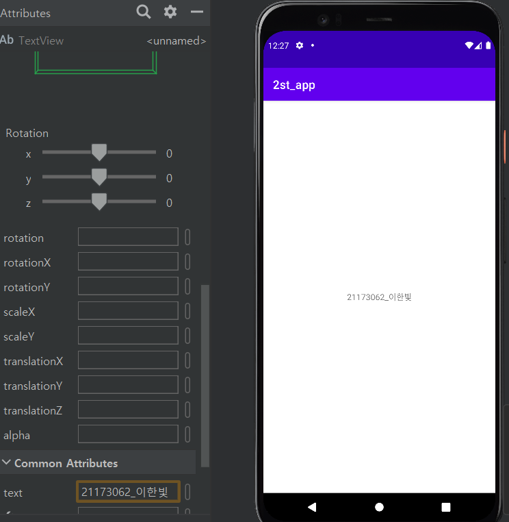</img> 
 
 
# 3주차(2022-03-22)
- 안드로이드스튜디오 네이버 화면 & 전화 걸기 & 메세지 만듬
 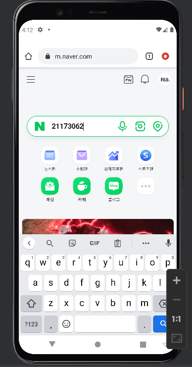</img>
 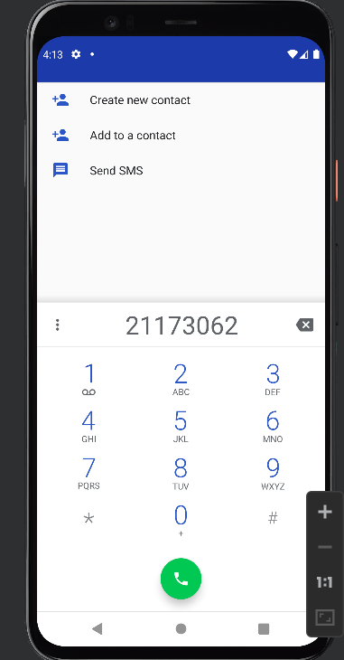</img>
 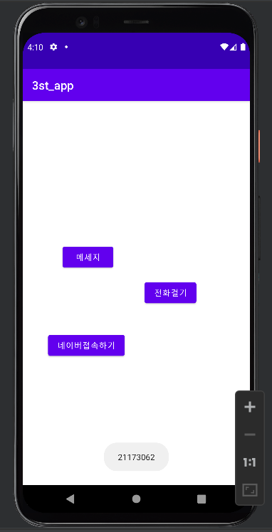</img>

# 5주차(2022-04-05)
- 이미지 바꾸기
 </img>
 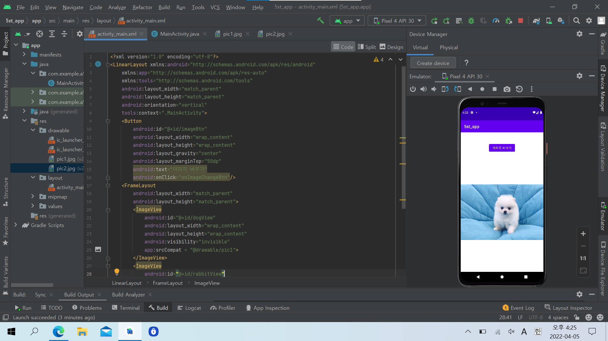</img>
 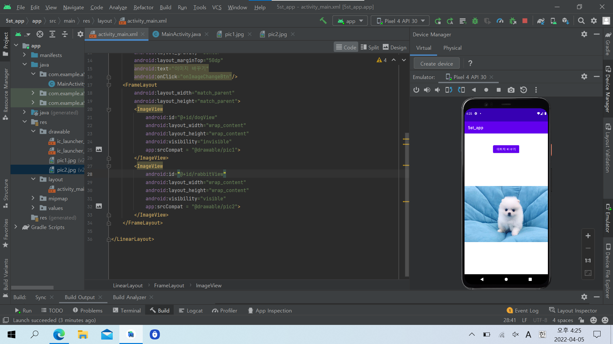</img>

# 6주차(2022-04-12)
- bitmap & 스크롤뷰
 </img>
 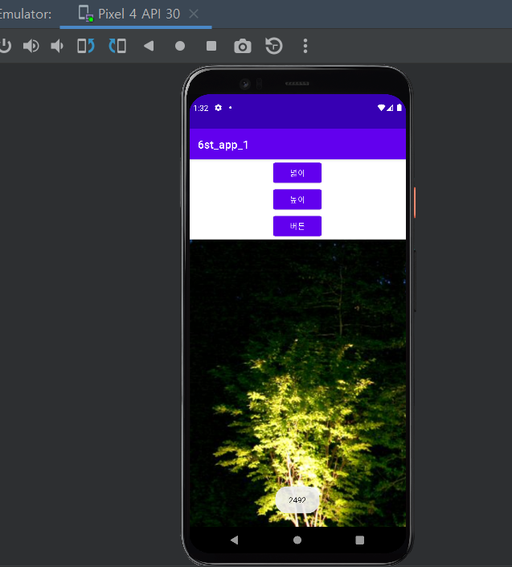</img>

# 10주차(2022-05-10)
- 여러 화면 만들고 화면 간 전환하기
 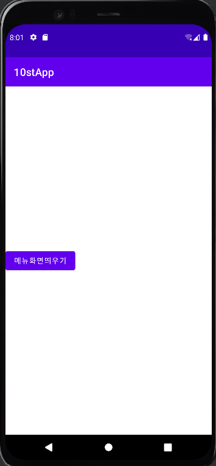</img>
 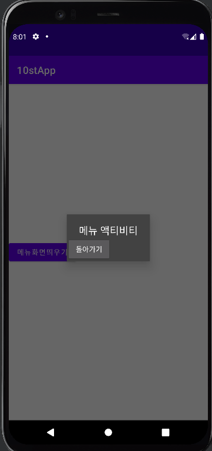</img>
 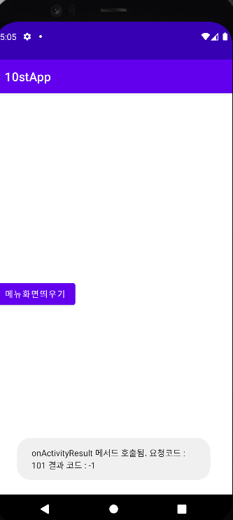</img>
 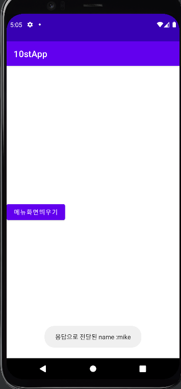</img>
 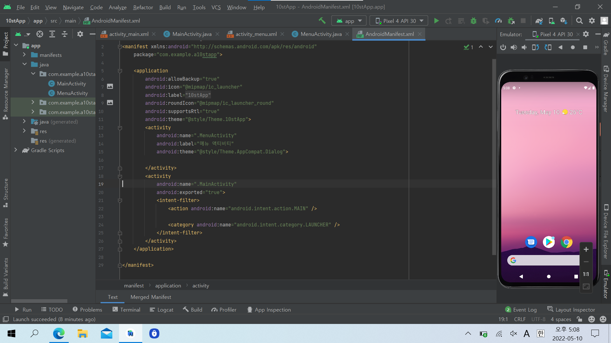</img>
 </img>
 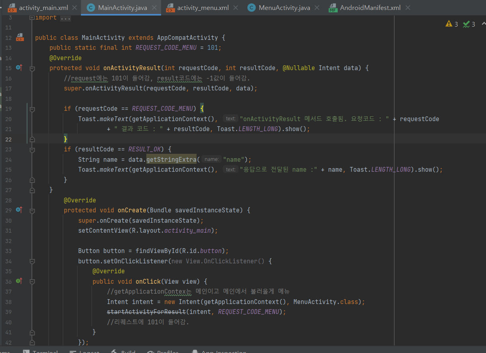</img>
